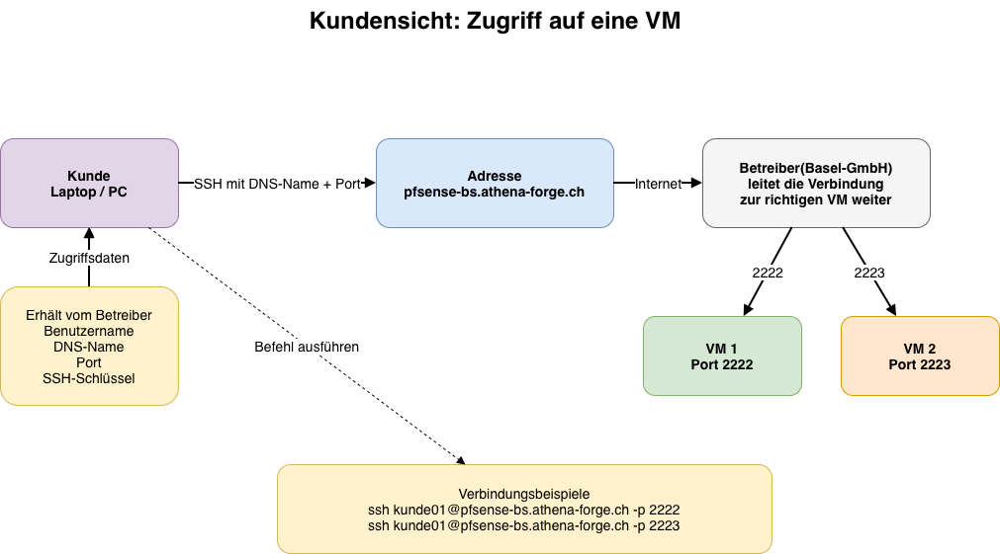
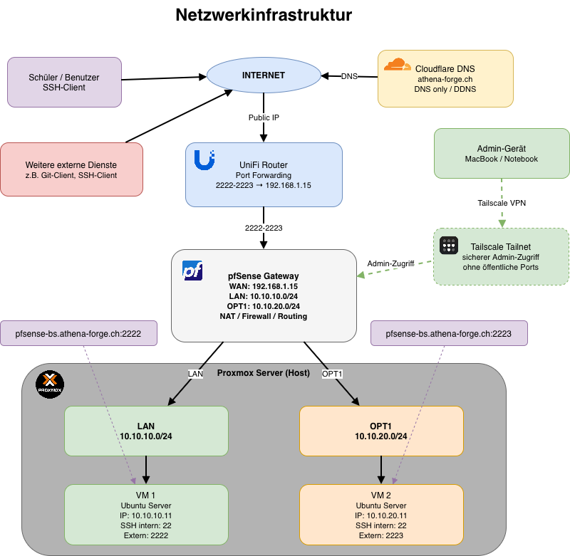

# Gesamtdokumentation: VM-Bestellung und externer Zugriff über Proxmox, pfSense, Cloudflare und Tailscale

\begin{center}
\includegraphics[width=0.20\textwidth]{images/proxmox_Logo.png}
\hspace{1cm}
\includegraphics[width=0.20\textwidth]{images/pfsense-img.png}
\hspace{1cm}
\includegraphics[width=0.20\textwidth]{images/tailscale-img.png}
\end{center}

---

# Kapitel 1: Protokollbeschreibung – Bestellung und Zugriff auf eine VM

## 1.1 Ziel dieses Kapitels

Dieses Kapitel beschreibt einfach und verständlich, wie eine virtuelle Maschine bestellt und anschliessend verwendet werden kann. Die Beschreibung ist aus Kundensicht geschrieben. Der Kunde muss keine technischen Details zu Proxmox, pfSense, Cloudflare oder Netzwerken kennen.

Im Mittelpunkt stehen folgende Fragen:

- Wie kann eine VM bestellt werden?
- Welche Informationen muss der Kunde liefern?
- Was richtet die Basel-GmbH ein?
- Welche Zugangsdaten erhält der Kunde?
- Wie verbindet sich der Kunde mit der VM?

## 1.2 Wie bestellt der Kunde eine VM?

Der Kunde kontaktiert die Basel-GmbH und teilt mit, dass er eine VM benötigt. Die Anfrage kann zum Beispiel per E-Mail erfolgen.

Beispiel:

```text
Guten Tag

Ich benötige eine virtuelle Maschine für Testzwecke.
Die VM soll von extern per SSH erreichbar sein.

Freundliche Grüsse
<Kunde>
```

## 1.3 Welche Informationen muss der Kunde angeben?

Damit die VM korrekt erstellt werden kann, muss der Kunde einige Angaben machen.

| Angabe | Erklärung | Beispiel |
|---|---|---|
| Zweck der VM | Wofür wird die VM verwendet? | Testsystem |
| Betriebssystem | Welches System soll installiert werden? | Ubuntu Server |
| Benutzername | Mit welchem Namen möchte sich der Kunde anmelden? | `kunde01` |
| Zugriff | Wie möchte der Kunde auf die VM zugreifen? | SSH |
| SSH Public Key | Schlüssel für den sicheren Zugriff | `ssh-ed25519 ...` |
| Laufzeit | Wie lange wird die VM benötigt? | bis Projektende |

Der wichtigste Punkt ist der **SSH Public Key**. Damit kann sich der Kunde sicher auf der VM anmelden, ohne dass ein Passwort per E-Mail verschickt werden muss.

## 1.4 Was macht die Basel-GmbH?

Nachdem die Bestellung eingegangen ist, erstellt die Basel-GmbH die VM auf der Proxmox-Umgebung.

Die Basel-GmbH erledigt dabei folgende Schritte:

1. Sie prüft, ob genügend Ressourcen vorhanden sind.
2. Sie erstellt die VM.
3. Sie installiert das gewünschte Betriebssystem.
4. Sie erstellt den Benutzer für den Kunden.
5. Sie hinterlegt den SSH Public Key des Kunden.
6. Sie richtet den externen Zugriff ein.
7. Sie testet, ob die VM erreichbar ist.
8. Sie sendet dem Kunden die Zugriffsinformationen.

## 1.5 Welche Informationen erhält der Kunde?

Nach der Bereitstellung erhält der Kunde eine kurze Rückmeldung mit den wichtigsten Angaben.

Beispiel:

```text
Guten Tag

Ihre virtuelle Maschine wurde erstellt.

VM-Name: vm-kunde01
Betriebssystem: Ubuntu Server
DNS-Name: pfsense-bs.athena-forge.ch
SSH-Port: 2222
Benutzername: kunde01

Sie können sich mit folgendem Befehl verbinden:
ssh kunde01@pfsense-bs.athena-forge.ch -p 2222

Freundliche Grüsse
<Basel-GmbH>
```

## 1.6 Übersicht des Kundenzugriffs

{ width=100% }

Die Darstellung zeigt den Zugriff aus Sicht des Kunden. Der Kunde muss keine technischen Details zur Infrastruktur kennen. Für ihn sind nur die erhaltenen Zugangsdaten wichtig.

Der Kunde erhält von der Basel-GmbH einen Benutzernamen, einen DNS-Namen, einen Port und die Information, welcher SSH-Schlüssel verwendet wird. Mit diesen Angaben kann er sich von seinem eigenen Computer aus mit der VM verbinden.

Der DNS-Name, zum Beispiel `pfsense-bs.athena-forge.ch`, dient als Adresse zur Umgebung der Basel-GmbH. Der Port entscheidet, welche VM erreicht wird. Wenn mehrere VMs über dieselbe Adresse erreichbar sind, wird jede VM über einen eigenen Port angesprochen.

| DNS-Name | Port | Ziel |
|---|---:|---|
| `pfsense-bs.athena-forge.ch` | `2222` | VM 1 |
| `pfsense-bs.athena-forge.ch` | `2223` | VM 2 |

Der Kunde muss sich nicht darum kümmern, wie die Verbindung intern weitergeleitet wird. Diese Weiterleitung wird von der Basel-GmbH eingerichtet und betrieben. Für den Kunden reicht es aus, den bereitgestellten SSH-Befehl zu verwenden.

Beispiel:

```bash
ssh kunde01@pfsense-bs.athena-forge.ch -p 2222
```

## 1.7 Wie greift der Kunde auf die VM zu?

Der Kunde verbindet sich mit der VM über SSH. SSH ist eine sichere Verbindungsmethode, mit welcher man eine entfernte Linux-VM bedienen kann.

Der Kunde öffnet auf seinem Computer ein Terminal und gibt folgenden Befehl ein:

```bash
ssh kunde01@pfsense-bs.athena-forge.ch -p 2222
```

Dabei bedeutet:

| Teil | Bedeutung |
|---|---|
| `ssh` | Programm für die sichere Verbindung |
| `kunde01` | Benutzername auf der VM |
| `pfsense-bs.athena-forge.ch` | Adresse, über welche die VM erreichbar ist |
| `-p 2222` | Port, über welchen die richtige VM erreicht wird |

Wenn ein bestimmter private SSH-Key verwendet werden muss, kann der Kunde den Zugriff so starten:

```bash
ssh -i ~/.ssh/id_ed25519 kunde01@pfsense-bs.athena-forge.ch -p 2222
```

## 1.8 Warum braucht es einen Port?

Da mehrere VMs über dieselbe öffentliche Adresse erreichbar sein können, erhält jede VM einen eigenen Port. Der Port ist vergleichbar mit einer Türnummer. Die Adresse zeigt zum richtigen Standort, der Port zeigt zur richtigen VM.

| Adresse | Port | Ziel |
|---|---:|---|
| `pfsense-bs.athena-forge.ch` | `2222` | VM 1 |
| `pfsense-bs.athena-forge.ch` | `2223` | VM 2 |

Der Kunde muss sich nur den DNS-Namen, den Benutzernamen und den Port merken.

## 1.9 Einfacher Ablauf zusammengefasst

```text
1. Kunde bestellt eine VM
2. Kunde gibt Zweck, Benutzername und SSH Public Key an
3. Basel-GmbH erstellt die VM
4. Basel-GmbH richtet den Zugriff ein
5. Kunde erhält DNS-Name, Benutzername und Port
6. Kunde verbindet sich per SSH mit der VM
```

## 1.10 Fazit

Eine VM kann einfach bestellt werden, indem der Kunde der Basel-GmbH die benötigten Informationen mitteilt. Die Basel-GmbH erstellt die VM, richtet den Zugriff ein und sendet dem Kunden anschliessend die Verbindungsdaten.

---

# Kapitel 2: Technische Umsetzung – Proxmox, pfSense, Cloudflare und Tailscale

## 2.1 Ausgangslage

Im Rahmen des Projekts soll eine Netzwerkumgebung aufgebaut werden, in welcher zwei Ubuntu-Server-VMs in voneinander getrennten Netzen betrieben werden. Zusätzlich soll ein externer Zugriff auf diese Systeme ermöglicht werden, ohne direkt mit der öffentlichen IP-Adresse arbeiten zu müssen.

Die Umgebung basiert auf einem Proxmox-Host, auf welchem mehrere virtuelle Maschinen betrieben werden. Als zentrale Netzwerkkomponente wird eine pfSense-Firewall eingesetzt. Diese übernimmt die Funktion des Gateways zwischen den internen Netzen und dem WAN-Netz.

Eine Anforderung war, dass ein Gateway mit zwei internen Netzen bereitgestellt wird:

- Netz 1: `10.10.10.0/24` mit Gateway `10.10.10.1`
- Netz 2: `10.10.20.0/24` mit Gateway `10.10.20.1`

In diesen beiden Netzen befindet sich jeweils eine eigene Ubuntu-Server-VM. Die VMs dienen dazu, die Netztrennung sowie die Kommunikation zwischen den beiden Netzen zu testen. Zusätzlich können die Systeme später für Dienste wie Git oder Ansible verwendet werden.

## 2.2 Ziel der Umsetzung

Ziel des Projekts ist der Aufbau einer funktionierenden virtuellen Netzwerkumgebung mit folgenden Eigenschaften:

- Aufbau von zwei getrennten internen Netzbereichen
- Einsatz einer pfSense-VM als Firewall und Gateway
- Routing zwischen WAN, LAN und OPT1 über pfSense
- Zugriff auf die internen VMs über Portweiterleitungen
- Zugriff von extern über die öffentliche IP-Adresse des Routers
- Nutzung eines DNS-Namens über Cloudflare, damit nicht direkt mit der öffentlichen IP-Adresse gearbeitet werden muss
- Automatische Aktualisierung der öffentlichen IP-Adresse über Dynamic DNS
- Separater Administrationszugriff über Tailscale

## 2.3 Netzwerkübersicht

Die Umgebung wurde auf einem Proxmox-Host aufgebaut. Neben der bestehenden Standard-Bridge `vmbr0` wurden zwei zusätzliche Bridges erstellt.

| Komponente | Funktion | Zugewiesenes Netz / Interface |
|---|---|---|
| Proxmox `vmbr0` | WAN-Anbindung der pfSense | Externes / bestehendes Netzwerk |
| Proxmox `vmbr1` | Internes Netz 1 | `10.10.10.0/24` |
| Proxmox `vmbr2` | Internes Netz 2 | `10.10.20.0/24` |
| pfSense WAN | Verbindung zum Router / Internet | `192.168.1.15` über `vmbr0` |
| pfSense LAN | Gateway für Netz 1 | `10.10.10.1` |
| pfSense OPT1 | Gateway für Netz 2 | `10.10.20.1` |
| VM Netz 1 | Ubuntu Server | `10.10.10.11` |
| VM Netz 2 | Ubuntu Server | `10.10.20.11` |
| Ubuntu Desktop VM | Administrations-Client | Zugriff auf pfSense WebGUI |

## 2.4 Beschreibung der Netzwerkinfrastruktur

{ width=80% }

Die Zeichnung zeigt die Netzwerkinfrastruktur für den externen Zugriff auf zwei virtuelle Maschinen. Die Umgebung besteht aus einem Proxmox-Server, einer pfSense-Firewall, einem UniFi-Router sowie DNS über die Domain `athena-forge.ch`.

Der Zugriff von extern erfolgt über den DNS-Namen `pfsense-bs.athena-forge.ch`. Dieser Name zeigt auf die öffentliche IP-Adresse des Routers. Damit die öffentliche IP-Adresse nicht manuell angepasst werden muss, wird Dynamic DNS verwendet. Die DNS-Verwaltung erfolgt über Cloudflare. Der UniFi-Router aktualisiert den DNS-Eintrag automatisch, falls sich die öffentliche IP-Adresse ändert.

Die Domain `athena-forge.ch` ist bei Hostpoint registriert. Die Nameserver der Domain wurden jedoch auf Cloudflare geändert. Dadurch wird die DNS-Zone nicht mehr bei Hostpoint, sondern bei Cloudflare verwaltet.

Vom Internet aus erreichen die Verbindungen zuerst den UniFi-Router. Dort werden die externen Ports `2222` und `2223` an die WAN-Adresse der pfSense weitergeleitet. Die pfSense hat auf der WAN-Seite die IP-Adresse `192.168.1.15`.

Die pfSense übernimmt anschliessend die Firewall- und Routing-Funktion. Zusätzlich führt sie NAT-Regeln aus, damit die eingehenden Verbindungen an die richtigen internen VMs weitergeleitet werden.

Die erste VM befindet sich im Netz `10.10.10.0/24` und hat die IP-Adresse `10.10.10.11`. Sie ist von extern über folgenden Befehl erreichbar:

```bash
ssh <benutzer>@pfsense-bs.athena-forge.ch -p 2222
```

Die zweite VM befindet sich im Netz `10.10.20.0/24` und hat die IP-Adresse `10.10.20.11`. Sie ist von extern über folgenden Befehl erreichbar:

```bash
ssh <benutzer>@pfsense-bs.athena-forge.ch -p 2223
```

Auf den VMs selbst läuft SSH weiterhin auf dem Standard-Port `22`. Die Ports `2222` und `2223` sind nur die externen Ports. Die Übersetzung auf Port `22` erfolgt durch die NAT-Regeln auf der pfSense.

Die beiden internen Netze sind voneinander getrennt. Das erste Netz läuft über das LAN-Interface der pfSense, das zweite Netz über das OPT1-Interface. Dadurch kann getestet werden, ob zwei getrennte Netze über ein Gateway korrekt betrieben und kontrolliert miteinander verbunden werden können.

Zusätzlich ist in der Zeichnung Tailscale eingezeichnet. Tailscale dient als separater Administrationszugang. Administratoren können sich über Tailscale sicher mit der Umgebung verbinden, ohne dafür zusätzliche öffentliche Ports freigeben zu müssen. Der normale Benutzerzugriff läuft über DNS, UniFi-Portweiterleitung und pfSense-NAT. Der administrative Zugriff kann getrennt davon über Tailscale erfolgen.

| Zugriff | Zweck |
|---|---|
| Cloudflare DNS → UniFi → pfSense → VM | Zugriff für Benutzer oder Kunden auf freigegebene VMs |
| Tailscale → interne Infrastruktur | Sicherer administrativer Zugriff für Betreiber |

## 2.5 Aufbau auf dem Proxmox-Host

Auf dem Proxmox-Host existierte bereits die Bridge `vmbr0`. Diese wurde weiterhin für die WAN-Seite der pfSense verwendet.

Zusätzlich wurden zwei weitere Bridges erstellt:

- `vmbr1` für das interne Netz `10.10.10.0/24`
- `vmbr2` für das interne Netz `10.10.20.0/24`

Diese Bridges dienen als virtuelle Switches innerhalb von Proxmox. Dadurch können die VMs voneinander getrennt, aber kontrolliert über pfSense miteinander verbunden werden.

Der pfSense-VM wurden drei virtuelle Netzwerkadapter zugewiesen:

| pfSense Interface | Proxmox Bridge | Zweck |
|---|---|---|
| WAN | `vmbr0` | Verbindung zum bestehenden Netzwerk / Router, statische IP `192.168.1.15` |
| LAN | `vmbr1` | Internes Netz 1 |
| OPT1 | `vmbr2` | Internes Netz 2 |

Die pfSense übernimmt damit die Rolle des zentralen Gateways für beide internen Netze.

## 2.6 Konfiguration der pfSense

Nach der Installation von pfSense wurden die Interfaces wie folgt zugewiesen:

- `vmbr0` als WAN
- `vmbr1` als LAN
- `vmbr2` als OPT1

Die Gateway-Adressen wurden wie folgt definiert:

| Interface | IP-Adresse | Netz |
|---|---:|---|
| WAN | `192.168.1.15` | bestehendes Router-Netz |
| LAN | `10.10.10.1` | `10.10.10.0/24` |
| OPT1 | `10.10.20.1` | `10.10.20.0/24` |

Damit Geräte im OPT1-Netz kommunizieren können, musste auf pfSense eine Firewall-Regel für OPT1 erstellt werden.

```bash
easyrule pass opt1 any 10.10.20.0/24 any
```

Diese Regel erlaubt grundsätzlich Traffic aus dem OPT1-Netz. Ohne eine entsprechende Regel würde pfSense den Verkehr auf OPT1 standardmässig blockieren.

## 2.7 Erstellung der Ubuntu-VMs

Im nächsten Schritt wurden zwei Ubuntu-Server-VMs erstellt.

| Einstellung | VM im ersten Netz | VM im zweiten Netz |
|---|---|---|
| IP-Adresse | `10.10.10.11` | `10.10.20.11` |
| Netz | `10.10.10.0/24` | `10.10.20.0/24` |
| Gateway | `10.10.10.1` | `10.10.20.1` |
| Bridge | `vmbr1` | `vmbr2` |
| Distribution | Ubuntu Server | Ubuntu Server |
| Zweck | Test-VM im ersten Netz, optional Git-Server | Test-VM im zweiten Netz, optional Ansible-Server |

## 2.8 Administrationszugriff

Da die pfSense Weboberfläche aus Sicherheitsgründen nicht über das WAN-Interface erreichbar ist, wurde zusätzlich eine Ubuntu Desktop VM erstellt.

Diese Desktop-VM dient als Administrationssystem innerhalb der virtuellen Umgebung. Über diese VM kann die pfSense Weboberfläche erreicht und verwaltet werden.

Der Zugriff erfolgt intern über das jeweilige LAN-Interface der pfSense, zum Beispiel über:

```text
https://10.10.10.1
```

Zusätzlich kann der administrative Zugriff über Tailscale erfolgen. Dadurch können Administratoren sicher auf die Umgebung zugreifen, ohne die pfSense Weboberfläche öffentlich erreichbar zu machen.

## 2.9 NAT- und Portweiterleitung auf pfSense

Damit von extern auf die internen Ubuntu-Server zugegriffen werden kann, wurden auf der pfSense NAT-Portweiterleitungen eingerichtet.

| Externer Port | Interne Ziel-VM | Interner Port | Zweck |
|---:|---|---:|---|
| `2222` | VM im ersten Netz `10.10.10.11` | `22` | SSH-Zugriff auf VM im ersten Netz |
| `2223` | VM im zweiten Netz `10.10.20.11` | `22` | SSH-Zugriff auf VM im zweiten Netz |

Beispiele:

```bash
ssh <benutzername>@pfsense-bs.athena-forge.ch -p 2222
ssh <benutzername>@pfsense-bs.athena-forge.ch -p 2223
```

## 2.10 Portweiterleitung auf dem UniFi-Router

Da sich die pfSense hinter dem UniFi-Router befindet, musste zusätzlich auf dem Router eine Portweiterleitung eingerichtet werden.

Auf dem UniFi-Router wurden die Ports `2222` bis `2223` geöffnet und an die statische WAN-Adresse der pfSense `192.168.1.15` weitergeleitet.

\begin{center}
\includegraphics[width=0.35\textwidth]{images/unifi_portweiterleitung.drawio.png}
\end{center}

## 2.11 DNS-Verwaltung über Cloudflare

Damit der Zugriff nicht über die öffentliche IP-Adresse erfolgen muss, wird ein DNS-Name verwendet.

```text
pfsense-bs.athena-forge.ch
```

Die Domain `athena-forge.ch` ist bei Hostpoint registriert. Die Nameserver der Domain wurden jedoch auf Cloudflare geändert. Dadurch wird die DNS-Zone nicht mehr bei Hostpoint, sondern bei Cloudflare verwaltet.

In Cloudflare ist für `pfsense-bs.athena-forge.ch` ein DNS-Eintrag eingerichtet. Dieser zeigt auf die öffentliche IP-Adresse des UniFi-Routers.

Damit die öffentliche IP-Adresse bei einer Änderung nicht manuell angepasst werden muss, wird Dynamic DNS verwendet. Der UniFi-Router aktualisiert den DNS-Eintrag bei Cloudflare automatisch.

Wichtig ist, dass der DNS-Eintrag in Cloudflare auf `DNS only` gesetzt ist. Der Cloudflare Proxy wird nicht verwendet, da der Zugriff über SSH und eigene Ports erfolgt.

## 2.12 Gesamtablauf des externen Zugriffs

1. Der Client verbindet sich mit `pfsense-bs.athena-forge.ch` auf Port `2222` oder `2223`.
2. Der DNS-Name wird über Cloudflare zur öffentlichen IP-Adresse des UniFi-Routers aufgelöst.
3. Der UniFi-Router nimmt die Verbindung entgegen und leitet sie an die WAN-Adresse der pfSense `192.168.1.15` weiter.
4. pfSense verarbeitet die eingehende Verbindung auf dem WAN-Interface.
5. Die NAT-Regel der pfSense leitet die Verbindung an die passende interne Ubuntu-VM weiter.
6. Die Ziel-VM nimmt die Verbindung auf Port `22` entgegen.

## 2.13 Sicherheitsaspekte

Bei dieser Umsetzung wird SSH aus dem Internet erreichbar gemacht. Deshalb sind einige Sicherheitsmassnahmen wichtig:

- SSH-Zugriff sollte möglichst nur mit SSH-Key und nicht mit Passwort erlaubt werden.
- Root-Login per SSH sollte deaktiviert sein.
- Es sollten nur die benötigten Ports freigegeben werden.
- Die Portweiterleitungen sollten dokumentiert und regelmässig überprüft werden.
- Auf pfSense sollten keine unnötigen WAN-Regeln erstellt werden.
- Die pfSense WebGUI sollte nicht direkt über das WAN erreichbar sein.
- Der Cloudflare Proxy bleibt für SSH deaktiviert, da der DNS-Eintrag nur für die Namensauflösung verwendet wird.
- Der administrative Zugriff sollte bevorzugt über Tailscale erfolgen, damit keine zusätzlichen Administrationsports öffentlich geöffnet werden müssen.

## 2.14 Ergebnis

Durch die Umsetzung wurde eine virtuelle Netzwerkumgebung auf Proxmox aufgebaut, welche zwei getrennte interne Netze über eine pfSense-Firewall bereitstellt.

Die beiden Ubuntu-VMs befinden sich in unterschiedlichen Netzbereichen und verwenden jeweils pfSense als Gateway. Über NAT-Regeln auf der pfSense sowie eine zusätzliche Portweiterleitung auf dem UniFi-Router können die Systeme von extern erreicht werden.

Der Zugriff erfolgt nicht direkt über die öffentliche IP-Adresse, sondern über den DNS-Namen `pfsense-bs.athena-forge.ch`, welcher in Cloudflare verwaltet wird. Dadurch ist der Zugriff einfacher und verständlicher. Zusätzlich wird die öffentliche IP-Adresse über Dynamic DNS automatisch aktualisiert.

Die pfSense Weboberfläche bleibt intern erreichbar und wird nicht direkt ins Internet veröffentlicht. Für die Administration wurde eine separate Ubuntu Desktop VM erstellt, welche Zugriff auf die interne pfSense WebGUI ermöglicht. Zusätzlich kann Tailscale als sicherer Administrationszugang verwendet werden.

## 2.15 Zusammenfassung der wichtigsten Adressen und Ports

| Element | Wert |
|---|---|
| pfSense WAN-IP | `192.168.1.15` |
| pfSense LAN-Gateway | `10.10.10.1` |
| pfSense OPT1-Gateway | `10.10.20.1` |
| VM im ersten Netz | `10.10.10.11` |
| VM im zweiten Netz | `10.10.20.11` |
| Externer DNS-Name | `pfsense-bs.athena-forge.ch` |
| SSH VM im ersten Netz | Port `2222` |
| SSH VM im zweiten Netz | Port `2223` |
| DNS-Verwaltung | Cloudflare |
| Domain-Registrar | Hostpoint |
| Administrationszugriff | Tailscale / interne Ubuntu Desktop VM |

## 2.16 Kurzes Fazit

Das Projekt zeigt, wie mit Proxmox, pfSense, NAT, Cloudflare DNS und Tailscale eine getrennte virtuelle Serverumgebung aufgebaut werden kann. Die pfSense übernimmt dabei die zentrale Rolle als Gateway und Firewall. Durch die Kombination aus Proxmox-Bridges, internen Netzen, NAT-Regeln, UniFi-Portweiterleitung und Cloudflare-DNS-Eintrag ist ein externer Zugriff auf die internen VMs möglich, ohne die Netztrennung innerhalb der Umgebung aufzugeben.

Tailscale ergänzt die Lösung als sicherer Administrationszugang. Dadurch kann die Umgebung verwaltet werden, ohne zusätzliche Administrationsdienste direkt im Internet zu veröffentlichen.
